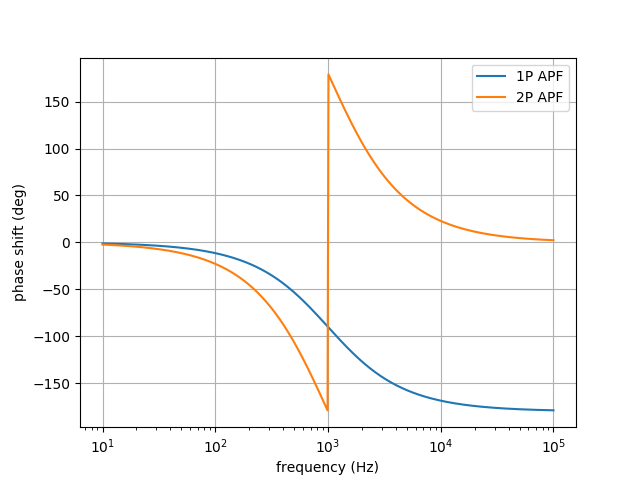
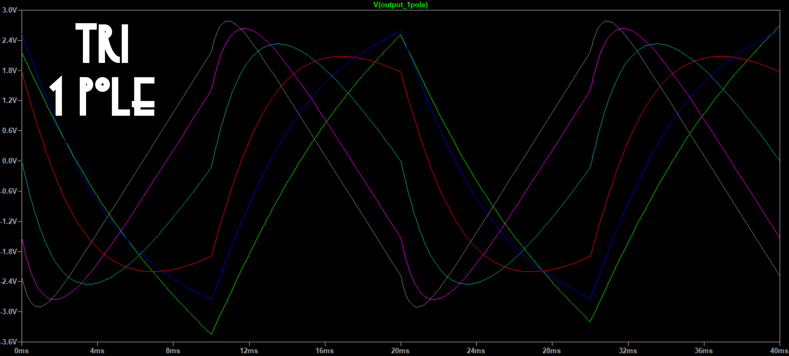
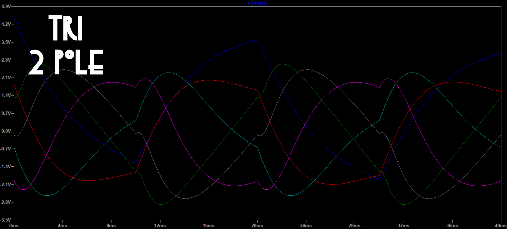
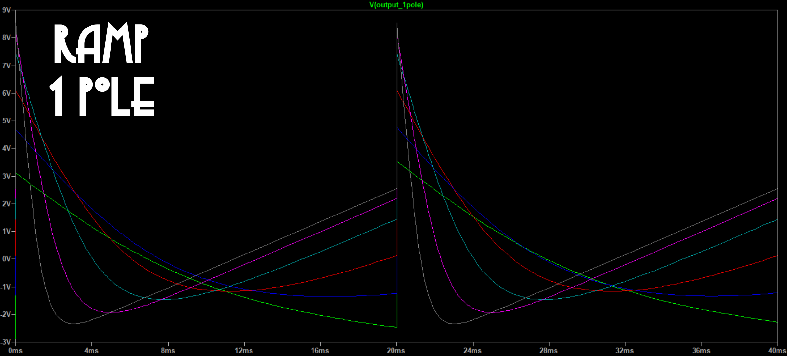
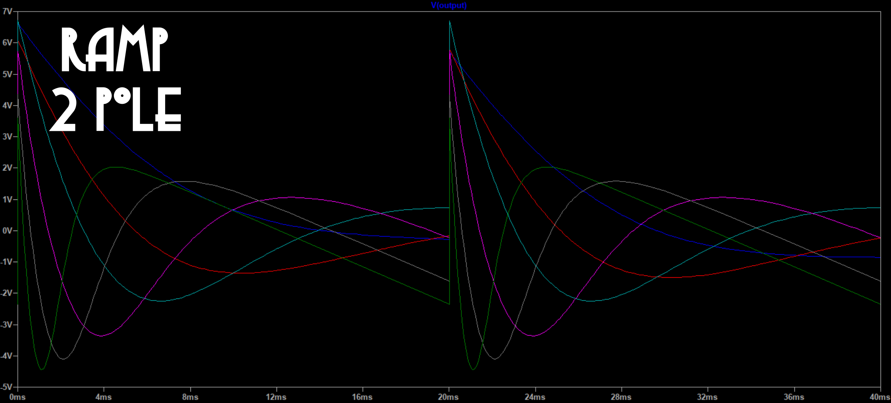
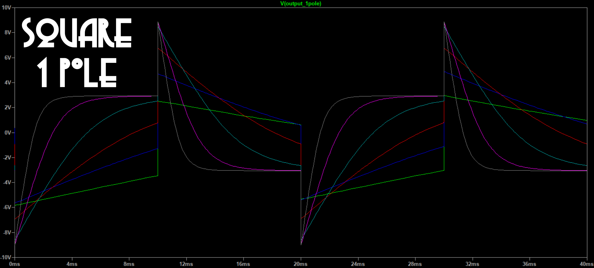
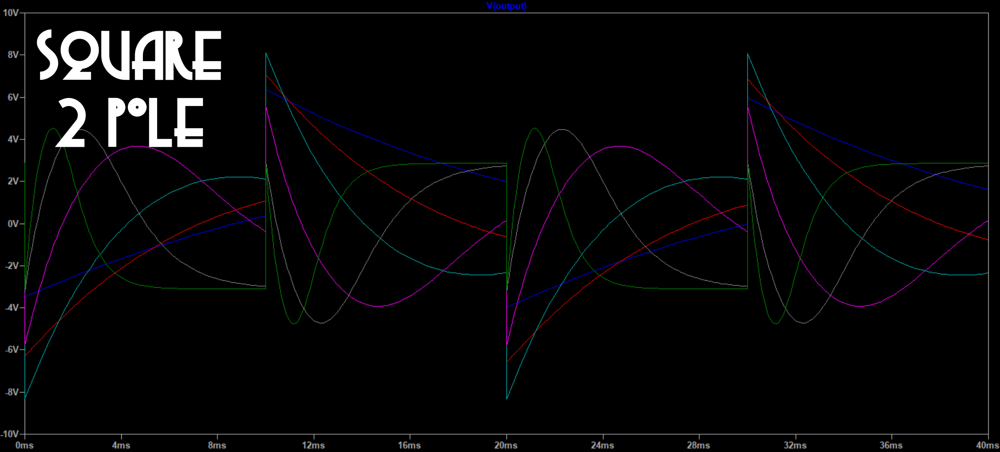
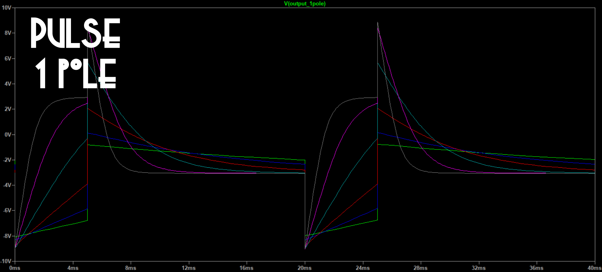
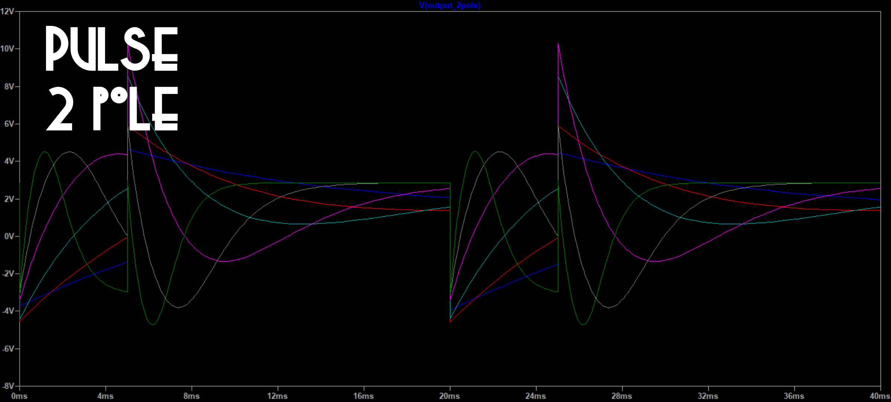
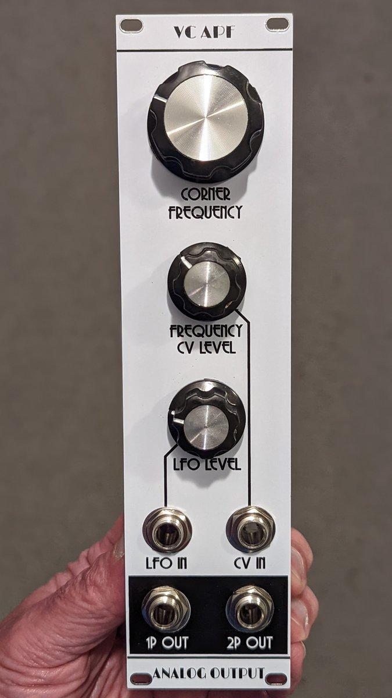

# Voltage controlled all pass filter

***Note**: At this point the main PCB has been tested and found to be satisfactory, but the first run jacks PCB had errors. They have been corrected in the design and Gerber files but the corrected board has not been tested. But what are the chances I'd get something so simple wrong twice? Shut up, it was a rhetorical question.*

This is an all pass filter (APF) intended to transform LFO wave shapes.

An all pass filter, as the name suggests, passes sine waves of any frequency with no change in amplitude. What does change is the phase angle, the relationship between the zero crossings (or peaks) of the input signal and those of the output. The phase shift depends on the frequency. A single pole APF produces a phase shift varying from 0° at low frequency to -90º at the corner frequency to -180° at high frequency. A two pole APF gives a phase shift from 0° at low frequency to -180º at the corner frequency to -360° at high frequency — the latter half of which is the same as +180° to 0°:



Putting a non sine periodic wave through an APF changes the wave's shape, since the different harmonics undergo different phase changes; the peak to peak amplitude can change as well, but usually not by a lot. Since the human ear isn't very sensitive to harmonic phases, this doesn't do much of anything interesting to audio waves. But it can produce interesting variants of low frequency CV waveshapes.

This module provides single pole and two pole APF outputs. It has input jacks for an LFO signal and a ±5 V corner frequency control voltage. There are attenuator pots for both inputs, and a knob to set the initial corner frequency.

Simulation results of applying 1- and 2-pole APF with various corner frequencies to triangle, ramp, and square waves are shown below:










A sin wave will not change shape, but its phase shift may be useful, if you want to vary two patch parameters with out of phase sin waves.

## Circuit description

The circuit is a simple voltage controlled two pole low pass filter (LPF), plus fixed mixing stages for producing APF outputs.

We start with a two pole LPF. This is a very standard design based on the LM13700 OTA datasheet. An exponential converter section transforms the linear control voltage into an exponential control current. Since this module is not intended for audio there is no need for accurate 1 V/oct response, and in fact it is less than 1 V/oct to provide a more useful corner frequency range with ±5 V CV. The filter stages themselves are typical aside from the large (100 nF) capacitors used to optimize the module for low frequency inputs. There is no feedback path to provide resonance, since resonance is not very useful here.

To get APF outputs we use an idea called pole mixing. If the output of a single pole LPF is doubled and subtracted from its input, the result is a single pole APF. To get a two pole APF one can take the input, subtact four times the single pole LPF output, and add four times the two pole LPF output. These mixings are done in op amp mixer stages with fixed resistor inputs. These are inverting stages, which for the single pole APF gives un-inverted (0° phase shift) output at low frequency. For the two pole APF we get inverted (180° phase shift) output at low frequency, so for consistency this signal goes through an additional inverting stage to obtain an un-inverted signal at low frequency at the output jack.

## LM13700

I designed the PCB to use the DIP version of the LM13700. This chip is out of production and getting harder to come by, though the SOIC version is available. I found these SOIC to DIP breakouts

* Chip-Quik PA0005 [https://www.digikey.com/en/products/detail/chip-quik-inc/PA0005/5014715](https://www.digikey.com/en/products/detail/chip-quik-inc/PA0005/5014715)
* Chip-Quik PA0005C [https://www.digikey.com/en/products/detail/chip-quik-inc/PA0005C/12352178](https://www.digikey.com/en/products/detail/chip-quik-inc/PA0005C/12352178)

one or the other of which probably could be used to assemble this PCB with a SOIC LM13700 — the second of those is narrower but costs more, and I think the first would work. (But I have a stash of DIP LM13700, so I haven't tried this.)

## Current draw
? mA +12 V, ? mA -12 V


## Photos



## Documentation

* [Schematic](Docs/vcapf.pdf)
* PCB layout: [front](Docs/vcapf_layout_front.pdf), [back](Docs/vcapf_layout_back.pdf)
* [BOM](Docs/vcapf_bom.md)
* [Build notes](Docs/build.md)
* [Blog post](https://analogoutputblog.wordpress.com/2022/05/07/voltage-controlled-all-pass-filter/)

## GitHub repository

* [https://github.com/holmesrichards/vcapf](https://github.com/holmesrichards/vcapf)

## Submodules

This repo uses submodules aoKicad and Kosmo_panel, which provide needed libaries for KiCad. To clone:

```
git clone git@github.com:holmesrichards/vcapf.git
git submodule init
git submodule update
```


Alternatively do

```
git clone --recurse-submodules git@github.com:holmesrichards/vcapf.git
```

Or if you download the repository as a zip file, you must also click on the "aoKicad" and "Kosmo\_panel" links on the GitHub page (they'll have "@ something" after them) and download them as separate zip files which you can unzip into this repo's aoKicad and Kosmo\_panel directories.

If desired, copy the files from aoKicad and Kosmo\_panel to wherever you prefer (your KiCad user library directory, for instance, if you have one). Then in KiCad, go into Edit Symbols and add symbol libraries 

```
aoKicad/ao_symbols
Kosmo_panel/Kosmo
```
and go into Edit Footprints and add footprint libraries 
```
aoKicad/ao_tht
Kosmo_panel/Kosmo_panel.
```
