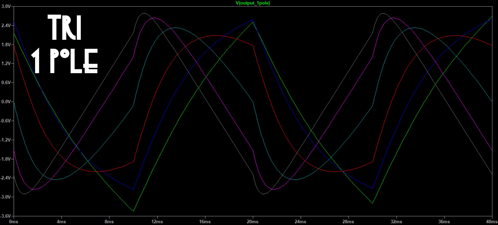
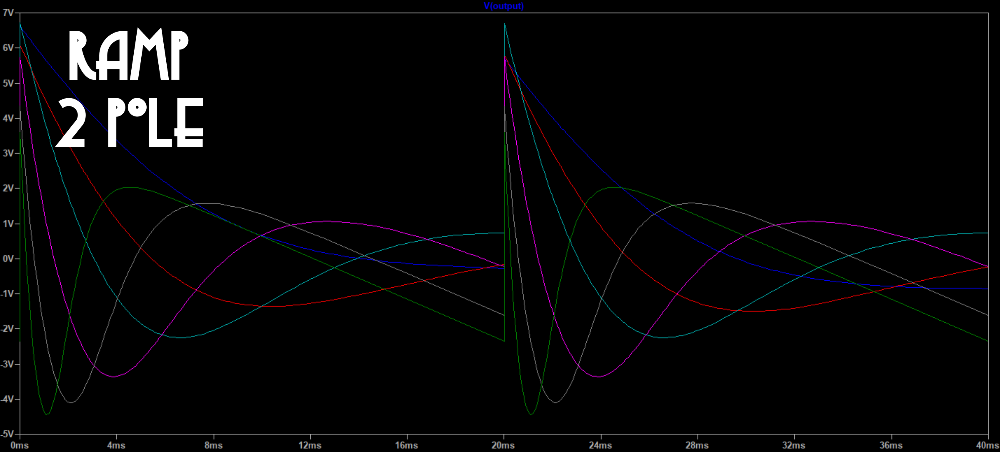
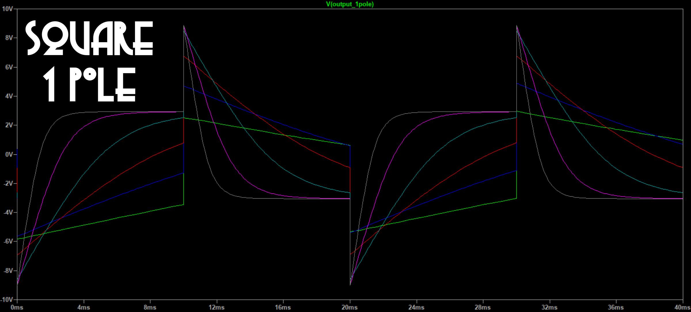
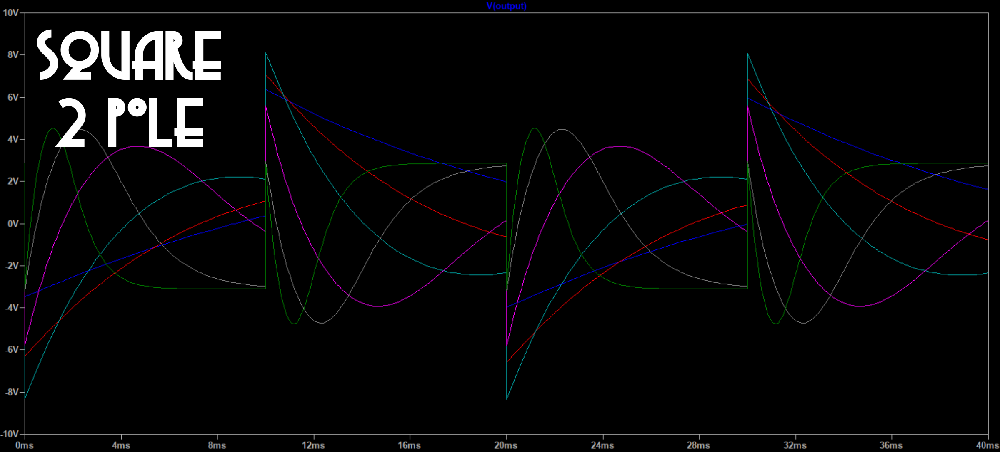

# All pass filter notes

An all pass filter, as the name suggest, passes sine waves of any frequency with no change in amplitude. What does change is the phase angle, the relationship between the zero crossings (or peaks) of the input signal and those of the output. The phase change depends on the frequency.

Putting a non sine periodic wave through an APF changes the wave's shape, since the different harmonics undergo different phase changes; the peak to peak amplitude can change as well, but usually not by a lot.

For audio frequencies, the audible consequences of this are — not much. The human auditory system is generally mostly insensitive to phase changes in harmonic content. So even though the wave shape changes, its sound stays about the same.

So an APF is not very useful for audio signal processing. But it can produce interesting variants of low frequency CV waveshapes.

A single pole APF can be created by taking a single pole low pass filter and summing the input, and -2 times the output. It has phase shift 0° at low frequency to -180° at high frequency. A two pole APF can be created by taking a two pole low pass filter and summing the input, -4 times the first pole, and +4 times the second pole. It has phase shift 180° at low frequency to -180° at high frequency. Both single and two pole outputs can be obtained from a two pole LPF.

Results of applying 1- and 2-pole APF to triangle, ramp, and square waves are shown below:

These were done with 6 Vpp input waveforms. One easily gets saturation for some waveforms and corner frequencies with 10 Vpp inputs. There should be an attenuator on the signal input.

The resulting waveforms may be biased away from zero. An output bias control might be useful. But since there are two outputs it should be two bias controls, and that many knobs might require making the module wider than it deserves. Bias can be added externally, of course.

